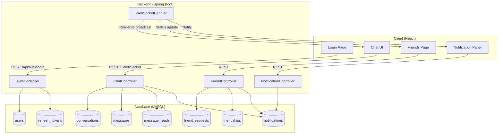

# 📘 Feature Specification & Data Flow – MessageClone

> **Version:** 1.0  
> **Date:** 2026-06-09  
> **Stack:** MySQL 8 + Spring Boot 3.2 + React (Vite) + WebSocket (STOMP)

---

## Mục lục

1. [Tổng quan hệ thống](#1-tổng-quan-hệ-thống)
2. [Authentication & Authorization](#2-authentication--authorization)
3. [Quản lý người dùng](#3-quản-lý-người-dùng)
4. [Chat 1-1 (Private Chat)](#4-chat-1-1-private-chat)
5. [Chat nhóm (Group Chat)](#5-chat-nhóm-group-chat)
6. [Gửi & Nhận tin nhắn](#6-gửi--nhận-tin-nhắn)
7. [Read Receipt (Đánh dấu đã đọc)](#7-read-receipt-đánh-dấu-đã-đọc)
8. [Reply tin nhắn](#8-reply-tin-nhắn)
9. [Upload file](#9-upload-file)
10. [Kết bạn (Friend Request / Friendship)](#10-kết-bạn-friend-request--friendship)
11. [Hủy kết bạn (Unfriend)](#11-hủy-kết-bạn-unfriend)
12. [Thông báo in-app (Notifications)](#12-thông-báo-in-app-notifications)
13. [Online / Offline Status](#13-online--offline-status)
14. [WebSocket Events](#14-websocket-events)
15. [Phân trang tin nhắn](#15-phân-trang-tin-nhắn)

---

## 1. Tổng quan hệ thống

### 1.1 Kiến trúc tổng thể

```
┌──────────────────────────────────────────────────────────────────┐
│                        CLIENT (React + Vite)                     │
│  ┌─────────┐  ┌──────────┐  ┌──────────┐  ┌──────────────────┐  │
│  │  Login  │  │ Chat UI  │  │ Friend   │  │  Notification    │  │
│  │  Page   │  │ (Active)  │  │  Page    │  │     Panel        │  │
│  └────┬────┘  └────┬─────┘  └────┬─────┘  └────────┬─────────┘  │
│       │            │              │                  │           │
│       │    HTTP REST (Axios)      │                  │           │
│       │    WebSocket (STOMP/SockJS)                  │           │
└───────┼────────────┼──────────────┼──────────────────┼───────────┘
        │            │              │                  │
        ▼            ▼              ▼                  ▼
┌──────────────────────────────────────────────────────────────────┐
│                    SPRING BOOT 3.2 BACKEND                       │
│  ┌──────────┐ ┌──────────┐ ┌───────────┐ ┌──────────────────┐   │
│  │ Auth     │ │ Chat     │ │ Friend    │ │ Notification     │   │
│  │ Service  │ │ Service  │ │ Service   │ │ Service          │   │
│  └────┬─────┘ └────┬─────┘ └─────┬─────┘ └────────┬─────────┘   │
│       │             │             │                │            │
│  ┌────┴─────────────┴─────────────┴────────────────┴────────┐   │
│  │                   JPA Repository Layer                    │   │
│  └──────────────────────────┬───────────────────────────────┘   │
│                             │                                    │
│                    ┌────────┴────────┐                           │
│                    │   MySQL 8 DB    │                           │
│                    └─────────────────┘                           │
└──────────────────────────────────────────────────────────────────┘
```

### 1.2 Giao thức giao tiếp

| Giao thức | Mục đích | Công nghệ |
|-----------|----------|-----------|
| **HTTP REST** | CRUD operations, Auth, File Upload | Spring MVC + Axios |
| **WebSocket** | Real-time: tin nhắn, typing, online status, notification | STOMP over SockJS |
| **JWT** | Xác thực phi trạng thái (stateless auth) | Access Token + Refresh Token |

### 1.3 Các bảng dữ liệu tham gia

| Bảng | Vai trò |
|------|---------|
| `users` | Lưu thông tin người dùng, trạng thái online |
| `conversations` | Đại diện 1 cuộc trò chuyện (PRIVATE hoặc GROUP) |
| `conversation_participants` | Liên kết user ↔ conversation (N-N) |
| `messages` | Tất cả tin nhắn (text, image, file, video) |
| `message_reads` | Ai đã đọc tin nhắn nào, lúc nào |
| `refresh_tokens` | Quản lý JWT refresh token (đa thiết bị) |
| `friend_requests` | Lời mời kết bạn và trạng thái |
| `friendships` | Danh sách bạn bè (2 dòng / 1 cặp) |
| `notifications` | Thông báo in-app (message mới, friend request...) |

---

## 2. Authentication & Authorization

### 2.1 Đăng ký (Register)

**Luồng dữ liệu:**

```
 Client                    Backend                      Database
  │                          │                             │
  │  POST /api/auth/register │                             │
  │  {username, email,       │                             │
  │   password, displayName} │                             │
  │─────────────────────────▶│                             │
  │                          │  Kiểm tra username/email    │
  │                          │  tồn tại chưa?             │
  │                          │────────────────────────────▶│
  │                          │◀────────────────────────────│
  │                          │                             │
  │                          │  Hash password (BCrypt)     │
  │                          │  INSERT INTO users          │
  │                          │────────────────────────────▶│
  │                          │◀────────────────────────────│
  │                          │                             │
  │  {userId, username}      │                             │
  │◀─────────────────────────│                             │
```

**Bảng tham gia:** `users`  
**API:** `POST /api/auth/register`

---

### 2.2 Đăng nhập (Login)

**Luồng dữ liệu:**

```
 Client                    Backend                      Database
  │                          │                             │
  │  POST /api/auth/login    │                             │
  │  {username, password}    │                             │
  │─────────────────────────▶│                             │
  │                          │  SELECT FROM users          │
  │                          │  WHERE username = ?         │
  │                          │────────────────────────────▶│
  │                          │◀────────────────────────────│
  │                          │                             │
  │                          │  BCrypt.verify(password,    │
  │                          │    password_hash)           │
  │                          │                             │
  │                          │  ✅ OK → Tạo accessToken    │
  │                          │        + refreshToken       │
  │                          │  INSERT refresh_tokens      │
  │                          │────────────────────────────▶│
  │                          │◀────────────────────────────│
  │                          │                             │
  │                          │  UPDATE users               │
  │                          │  SET is_online = TRUE       │
  │                          │────────────────────────────▶│
  │                          │◀────────────────────────────│
  │                          │                             │
  │  {accessToken,           │                             │
  │   refreshToken, user}    │                             │
  │◀─────────────────────────│                             │
```

**Bảng tham gia:** `users`, `refresh_tokens`  
**API:** `POST /api/auth/login`

---

### 2.3 Refresh Token

**Luồng dữ liệu:**

```
 Client                    Backend                      Database
  │                          │                             │
  │  POST /api/auth/refresh  │                             │
  │  {refreshToken}          │                             │
  │─────────────────────────▶│                             │
  │                          │  SELECT FROM refresh_tokens │
  │                          │  WHERE token = ?            │
  │                          │────────────────────────────▶│
  │                          │◀────────────────────────────│
  │                          │                             │
  │                          │  ✅ Token hợp lệ + chưa     │
  │                          │     hết hạn → Tạo cặp mới   │
  │                          │  DELETE token cũ            │
  │                          │  INSERT token mới           │
  │                          │────────────────────────────▶│
  │                          │◀────────────────────────────│
  │                          │                             │
  │  {accessToken,           │                             │
  │   refreshToken}          │                             │
  │◀─────────────────────────│                             │
```

**Bảng tham gia:** `refresh_tokens`  
**API:** `POST /api/auth/refresh`

---

### 2.4 OAuth2 Login (Google / GitHub)

**Luồng dữ liệu:**

```
 Client           Google/GitHub         Backend                  Database
  │                    │                   │                        │
  │  Click "Login       │                   │                        │
  │  with Google"       │                   │                        │
  │────────────────────▶│                   │                        │
  │                    │  OAuth Consent     │                        │
  │  ← consent screen  │                   │                        │
  │◀────────────────────│                   │                        │
  │                    │                   │                        │
  │  Chấp nhận          │                   │                        │
  │────────────────────▶│                   │                        │
  │                    │  Redirect với      │                        │
  │                    │  authorization     │                        │
  │                    │  code              │                        │
  │  GET /oauth2/callback?code=xxx         │                        │
  │───────────────────────────────────────▶│                        │
  │                                         │  Exchange code lấy     │
  │                                         │  access_token từ       │
  │                                         │  Google/GitHub API     │
  │                                         │                        │
  │                                         │  Lấy user info         │
  │                                         │  (email, name, avatar) │
  │                                         │                        │
  │                                         │  SELECT FROM users      │
  │                                         │  WHERE provider=?      │
  │                                         │    AND provider_id=?   │
  │                                         │───────────────────────▶│
  │                                         │◀───────────────────────│
  │                                         │                        │
  │                                         │  ┌── Nếu chưa có:      │
  │                                         │  │ INSERT users        │
  │                                         │  │ (provider='GOOGLE', │
  │                                         │  │  password_hash=NULL)│
  │                                         │  └────────────────────▶│
  │                                         │◀───────────────────────│
  │                                         │                        │
  │  {accessToken, refreshToken, user}      │                        │
  │◀───────────────────────────────────────│                        │
```

**Bảng tham gia:** `users`, `refresh_tokens`  
**API:** `GET /api/oauth2/authorize/{provider}`, `GET /api/oauth2/callback/{provider}`

---

## 3. Quản lý người dùng

### 3.1 Tìm kiếm người dùng

**Luồng dữ liệu:**

```
 Client                    Backend                      Database
  │                          │                             │
  │  GET /api/users?q=dat    │                             │
  │─────────────────────────▶│                             │
  │                          │  SELECT FROM users          │
  │                          │  WHERE username LIKE '%dat%'│
  │                          │     OR display_name LIKE    │
  │                          │        '%dat%'              │
  │                          │  LIMIT 20                   │
  │                          │────────────────────────────▶│
  │                          │◀────────────────────────────│
  │                          │                             │
  │  [{id, username,         │                             │
  │    displayName,          │                             │
  │    avatarUrl, isOnline}] │                             │
  │◀─────────────────────────│                             │
```

**Bảng tham gia:** `users`  
**API:** `GET /api/users?q={keyword}`

---

### 3.2 Cập nhật Profile

**Luồng dữ liệu:**

```
 Client                    Backend                      Database
  │                          │                             │
  │  PUT /api/users/me       │                             │
  │  {displayName, bio}      │                             │
  │  (Authorization: Bearer) │                             │
  │─────────────────────────▶│                             │
  │                          │  Extract userId từ JWT      │
  │                          │  UPDATE users               │
  │                          │  SET display_name=?, bio=?  │
  │                          │  WHERE id = ?               │
  │                          │────────────────────────────▶│
  │                          │◀────────────────────────────│
  │                          │                             │
  │  {updated user}          │                             │
  │◀─────────────────────────│                             │
```

**Bảng tham gia:** `users`  
**API:** `PUT /api/users/me`

---

## 4. Chat 1-1 (Private Chat)

### 4.1 Bắt đầu chat 1-1

**Quy tắc:**
- 2 user chỉ có **duy nhất 1** conversation PRIVATE
- Khi user A click "Chat" với user B → Backend kiểm tra conversation đã tồn tại chưa
- Nếu chưa → tạo mới; nếu có → trả về conversation hiện tại

**Luồng dữ liệu:**

```
 Client A                  Backend                      Database
  │                          │                             │
  │  POST /api/conversations │                             │
  │  {type: "PRIVATE",       │                             │
  │   participantId: B}      │                             │
  │─────────────────────────▶│                             │
  │                          │  🔍 Tìm conversation PRIVATE│
  │                          │  có cả A và B tham gia:     │
  │                          │                             │
  │                          │  SELECT c.*                 │
  │                          │  FROM conversations c       │
  │                          │  JOIN conversation_         │
  │                          │    participants cp1         │
  │                          │    ON c.id=cp1.conversation_│
  │                          │       id AND cp1.user_id=A  │
  │                          │  JOIN conversation_         │
  │                          │    participants cp2         │
  │                          │    ON c.id=cp2.conversation_│
  │                          │       id AND cp2.user_id=B  │
  │                          │  WHERE c.type='PRIVATE'     │
  │                          │────────────────────────────▶│
  │                          │◀────────────────────────────│
  │                          │                             │
  │                          │  ┌── Nếu chưa tồn tại:      │
  │                          │  │ BEGIN TRANSACTION        │
  │                          │  │ INSERT conversations     │
  │                          │  │ (type='PRIVATE')         │
  │                          │  │ INSERT conversation_     │
  │                          │  │   participants x2        │
  │                          │  │   (A + B)                │
  │                          │  │ COMMIT                   │
  │                          │  └─────────────────────────▶│
  │                          │◀────────────────────────────│
  │                          │                             │
  │  {conversation}          │                             │
  │◀─────────────────────────│                             │
```

**Bảng tham gia:** `conversations`, `conversation_participants`  
**API:** `POST /api/conversations`

---

## 5. Chat nhóm (Group Chat)

### 5.1 Tạo nhóm

**Luồng dữ liệu:**

```
 Client A (Creator)         Backend                      Database
  │                          │                             │
  │  POST /api/conversations │                             │
  │  {type: "GROUP",         │                             │
  │   name: "Team Alpha",    │                             │
  │   participantIds: [B,C]} │                             │
  │─────────────────────────▶│                             │
  │                          │  BEGIN TRANSACTION          │
  │                          │                             │
  │                          │  INSERT conversations       │
  │                          │  (type='GROUP', name=...,   │
  │                          │   created_by=A)             │
  │                          │────────────────────────────▶│
  │                          │                             │
  │                          │  INSERT conversation_       │
  │                          │  participants (A, ADMIN)    │
  │                          │────────────────────────────▶│
  │                          │                             │
  │                          │  INSERT conversation_       │
  │                          │  participants (B, MEMBER)   │
  │                          │────────────────────────────▶│
  │                          │                             │
  │                          │  INSERT conversation_       │
  │                          │  participants (C, MEMBER)   │
  │                          │────────────────────────────▶│
  │                          │                             │
  │                          │  INSERT notifications       │
  │                          │  cho B, C (GROUP_INVITE)    │
  │                          │────────────────────────────▶│
  │                          │                             │
  │                          │  COMMIT                     │
  │                          │                             │
  │  {conversation}          │                             │
  │◀─────────────────────────│                             │
```

**Bảng tham gia:** `conversations`, `conversation_participants`, `notifications`  
**API:** `POST /api/conversations`

---

### 5.2 Thêm / Xóa thành viên

**Luồng thêm thành viên:**

```
 Client (Admin)             Backend                      Database
  │                          │                             │
  │  POST /api/conversations │                             │
  │    /{convId}/members     │                             │
  │  {userId: D}             │                             │
  │─────────────────────────▶│                             │
  │                          │  ✅ Kiểm tra: caller có     │
  │                          │     role=ADMIN?             │
  │                          │  INSERT conversation_       │
  │                          │  participants (D, MEMBER)   │
  │                          │────────────────────────────▶│
  │                          │  INSERT notifications       │
  │                          │  → user D (GROUP_INVITE)    │
  │                          │────────────────────────────▶│
  │                          │                             │
  │  {success}               │                             │
  │◀─────────────────────────│                             │
  │                          │                             │
  │  📡 WebSocket → D:       │                             │
  │  "Bạn được thêm vào      │                             │
  │   nhóm Team Alpha"       │                             │
```

**Bảng tham gia:** `conversation_participants`, `notifications`  
**API:** `POST /api/conversations/{convId}/members`

---

## 6. Gửi & Nhận tin nhắn

### 6.1 Gửi tin nhắn text

Đây là luồng **core** của toàn bộ ứng dụng:

```
 Client A                  Backend                      Database          Client B
  │                          │                             │                 │
  │  📡 SEND /app/chat.send  │                             │                 │
  │  {conversationId: 5,     │                             │                 │
  │   content: "Hello👋",    │                             │                 │
  │   messageType: "TEXT"}   │                             │                 │
  │─────────────────────────▶│                             │                 │
  │                          │  1️⃣ Validate input          │                 │
  │                          │                             │                 │
  │                          │  2️⃣ INSERT INTO messages    │                 │
  │                          │  (conversation_id,          │                 │
  │                          │   sender_id, content,       │                 │
  │                          │   message_type)             │                 │
  │                          │────────────────────────────▶│                 │
  │                          │◀────── messageId = 123 ─────│                 │
  │                          │                             │                 │
  │                          │  3️⃣ UPDATE conversations    │                 │
  │                          │  SET last_message = ?,      │                 │
  │                          │      last_message_at = NOW()│                 │
  │                          │  WHERE id = 5               │                 │
  │                          │────────────────────────────▶│                 │
  │                          │                             │                 │
  │                          │  4️⃣ INSERT notifications    │                 │
  │                          │  Vào bảng notifications     │                 │
  │                          │  cho từng participant       │                 │
  │                          │  (trừ sender)               │                 │
  │                          │────────────────────────────▶│                 │
  │                          │                             │                 │
  │                          │  5️⃣ 📡 Broadcast message    │                 │
  │                          │  đến tất cả participants    │                 │
  │                          │  qua WebSocket:             │                 │
  │                          │  /topic/chat.{convId}       │                 │
  │                          │─────────────────────────────────────────────▶│
  │                          │                             │                 │
  │  ◀── echo message ────  │                             │                 │
  │  (để client confirm)    │                             │  Nhận message   │
```

**Bảng tham gia:** `messages`, `conversations`, `notifications`  
**WebSocket:** `SEND /app/chat.send` → `SUBSCRIBE /topic/chat.{convId}`

---

### 6.2 Các loại tin nhắn

| message_type | Cột sử dụng | Mô tả |
|-------------|-------------|-------|
| `TEXT` | `content` = nội dung text | Tin nhắn văn bản thông thường |
| `IMAGE` | `content` = caption, `file_url` = link ảnh | Ảnh tải lên cloud |
| `FILE` | `content` = tên file, `file_url` = link download | File đính kèm |
| `VIDEO` | `content` = description, `file_url` = link video | Video tải lên cloud |

---

### 6.3 Sửa tin nhắn

**Luồng dữ liệu:**

```
 Client A                  Backend                      Database
  │                          │                             │
  │  📡 SEND /app/chat.edit  │                             │
  │  {messageId: 123,        │                             │
  │   newContent: "Hello!"}  │                             │
  │─────────────────────────▶│                             │
  │                          │  ✅ Chỉ sender mới sửa được │
  │                          │  UPDATE messages            │
  │                          │  SET content=?,             │
  │                          │      is_edited=TRUE,        │
  │                          │      edited_at=NOW()        │
  │                          │  WHERE id=? AND sender_id=? │
  │                          │────────────────────────────▶│
  │                          │                             │
  │                          │  📡 Broadcast update        │
  │                          │  /topic/chat.{convId}       │
```

**Bảng tham gia:** `messages`  
**WebSocket:** `SEND /app/chat.edit`

---

### 6.4 Xóa tin nhắn (Soft Delete)

```
 Client A                  Backend                      Database
  │                          │                             │
  │  📡 SEND /app/chat.delete│                             │
  │  {messageId: 123}        │                             │
  │─────────────────────────▶│                             │
  │                          │  ✅ Chỉ sender mới xóa được │
  │                          │  UPDATE messages            │
  │                          │  SET is_deleted=TRUE        │
  │                          │  WHERE id=? AND sender_id=? │
  │                          │────────────────────────────▶│
  │                          │                             │
  │                          │  📡 Broadcast "deleted"     │
  │                          │  /topic/chat.{convId}       │
```

**Bảng tham gia:** `messages`  
**WebSocket:** `SEND /app/chat.delete`

---

## 7. Read Receipt (Đánh dấu đã đọc)

### 7.1 Đánh dấu tin nhắn đã đọc

Khi user B mở conversation và nhìn thấy tin nhắn, client gửi read receipt:

```
 Client B                  Backend                      Database         Client A
  │                          │                             │                │
  │  📡 SEND /app/chat.read  │                             │                │
  │  {conversationId: 5,     │                             │                │
  │   lastReadMessageId: 123}│                             │                │
  │─────────────────────────▶│                             │                │
  │                          │  INSERT INTO message_reads  │                │
  │                          │  (message_id, user_id)      │                │
  │                          │  Với tất cả message_id      │                │
  │                          │  ≤ 123 trong conversation 5 │                │
  │                          │  mà B chưa đọc              │                │
  │                          │  (IGNORE nếu đã tồn tại)    │                │
  │                          │────────────────────────────▶│                │
  │                          │                             │                │
  │                          │  📡 Broadcast read receipt  │                │
  │                          │  /topic/chat.{convId}.read  │                │
  │                          │─────────────────────────────────────────────▶│
  │                          │                             │                │
  │                          │                             │  UI hiển thị    │
  │                          │                             │  "Đã đọc ✅"    │
```

**Bảng tham gia:** `message_reads`  
**WebSocket:** `SEND /app/chat.read` → `SUBSCRIBE /topic/chat.{convId}.read`

---

### 7.2 Lấy trạng thái đã đọc của 1 tin nhắn

```
 Client                    Backend                      Database
  │                          │                             │
  │  GET /api/messages/123   │                             │
  │    /read-status           │                             │
  │─────────────────────────▶│                             │
  │                          │  SELECT u.id, u.display_name│
  │                          │        u.avatar_url,        │
  │                          │        mr.read_at           │
  │                          │  FROM message_reads mr      │
  │                          │  JOIN users u               │
  │                          │    ON mr.user_id = u.id     │
  │                          │  WHERE mr.message_id = 123  │
  │                          │────────────────────────────▶│
  │                          │◀────────────────────────────│
  │                          │                             │
  │  [{userId, displayName,  │                             │
  │    avatarUrl, readAt}]   │                             │
  │◀─────────────────────────│                             │
```

**Bảng tham gia:** `message_reads`, `users`  
**API:** `GET /api/messages/{messageId}/read-status`

---

## 8. Reply tin nhắn

### 8.1 Trả lời 1 tin nhắn cụ thể

```
 Client A                  Backend                      Database          Client B
  │                          │                             │                 │
  │  📡 SEND /app/chat.send  │                             │                 │
  │  {conversationId: 5,     │                             │                 │
  │   content: "Đồng ý!",    │                             │                 │
  │   replyTo: 100}          │                             │                 │
  │─────────────────────────▶│                             │                 │
  │                          │  ✅ Validate: message 100   │                 │
  │                          │     có thuộc conversation 5?│                 │
  │                          │                             │                 │
  │                          │  INSERT messages            │                 │
  │                          │  (..., reply_to=100)        │                 │
  │                          │────────────────────────────▶│                 │
  │                          │                             │                 │
  │                          │  📡 Broadcast message       │                 │
  │                          │  (kèm replyTo info)        │                 │
  │                          │─────────────────────────────────────────────▶│
  │                          │                             │                 │
  │                          │                             │  UI render:     │
  │                          │                             │  ┌────────────┐ │
  │                          │                             │  │ > msg #100 │ │
  │                          │                             │  │ Đồng ý!    │ │
  │                          │                             │  └────────────┘ │
```

**Bảng tham gia:** `messages` (self-reference qua `reply_to`)  
**WebSocket:** `SEND /app/chat.send`

---

## 9. Upload file

### 9.1 Upload ảnh / file / video

```
 Client                    Backend               Cloud Storage          Database
  │                          │                       │                    │
  │  POST /api/files/upload  │                       │                    │
  │  multipart/form-data:    │                       │                    │
  │  - file                   │                       │                    │
  │  - conversationId         │                       │                    │
  │─────────────────────────▶│                       │                    │
  │                          │  Validate:            │                    │
  │                          │  - Dung lượng         │                    │
  │                          │  - Định dạng          │                    │
  │                          │                       │                    │
  │                          │  Upload → S3/Cloudinary│                   │
  │                          │──────────────────────▶│                    │
  │                          │◀────── fileUrl ───────│                    │
  │                          │                       │                    │
  │                          │  INSERT INTO messages │                    │
  │                          │  (conversation_id,    │                    │
  │                          │   sender_id,          │                    │
  │                          │   message_type=IMAGE, │                    │
  │                          │   file_url=fileUrl)   │                    │
  │                          │──────────────────────────────────────────▶│
  │                          │◀──────────────────────────────────────────│
  │                          │                       │                    │
  │                          │  📡 Broadcast message  │                    │
  │                          │  qua WebSocket        │                    │
  │                          │                       │                    │
  │  {message}               │                       │                    │
  │◀─────────────────────────│                       │                    │
```

**Bảng tham gia:** `messages`  
**API:** `POST /api/files/upload`

---

## 10. Kết bạn (Friend Request / Friendship)

### 10.1 Gửi lời mời kết bạn

```
 Client A                  Backend                      Database          Client B
  │                          │                             │                │
  │  POST /api/friends       │                             │                │
  │    /request/{userIdB}    │                             │                │
  │─────────────────────────▶│                             │                │
  │                          │  ✅ Validate:               │                │
  │                          │  - B có tồn tại?            │                │
  │                          │  - A != B?                  │                │
  │                          │  - Đã là bạn chưa?          │                │
  │                          │  - Đã có request PENDING?   │                │
  │                          │                             │                │
  │                          │  INSERT friend_requests     │                │
  │                          │  (sender_id=A,              │                │
  │                          │   receiver_id=B,            │                │
  │                          │   status='PENDING')         │                │
  │                          │────────────────────────────▶│                │
  │                          │                             │                │
  │                          │  INSERT notifications       │                │
  │                          │  → user B                   │                │
  │                          │  (type=FRIEND_REQUEST)      │                │
  │                          │────────────────────────────▶│                │
  │                          │                             │                │
  │                          │  📡 WebSocket → B:          │                │
  │                          │  /user/{B}/notifications    │                │
  │                          │─────────────────────────────────────────────▶│
  │                          │                             │                │
  │  {requestId, status:     │                             │  🔔 Nhận       │
  │   "PENDING"}             │                             │  thông báo     │
  │◀─────────────────────────│                             │                │
```

**Bảng tham gia:** `friend_requests`, `notifications`  
**API:** `POST /api/friends/request/{userId}`

---

### 10.2 Chấp nhận lời mời kết bạn

```
 Client B                  Backend                      Database          Client A
  │                          │                             │                │
  │  PUT /api/friends        │                             │                │
  │    /accept/{requestId}   │                             │                │
  │─────────────────────────▶│                             │                │
  │                          │  ✅ Validate:               │                │
  │                          │  - request tồn tại          │                │
  │                          │  - B là receiver            │                │
  │                          │  - status='PENDING'         │                │
  │                          │                             │                │
  │                          │  BEGIN TRANSACTION          │                │
  │                          │                             │                │
  │                          │  UPDATE friend_requests     │                │
  │                          │  SET status='ACCEPTED',     │                │
  │                          │      responded_at=NOW()     │                │
  │                          │  WHERE id=?                 │                │
  │                          │────────────────────────────▶│                │
  │                          │                             │                │
  │                          │  INSERT friendships (A, B)  │                │
  │                          │────────────────────────────▶│                │
  │                          │                             │                │
  │                          │  INSERT friendships (B, A)  │                │
  │                          │────────────────────────────▶│                │
  │                          │                             │                │
  │                          │  INSERT notifications       │                │
  │                          │  → user A                   │                │
  │                          │  (type=FRIEND_ACCEPTED)     │                │
  │                          │────────────────────────────▶│                │
  │                          │                             │                │
  │                          │  COMMIT                     │                │
  │                          │                             │                │
  │                          │  📡 WebSocket → A:          │                │
  │                          │  /user/{A}/notifications    │                │
  │                          │─────────────────────────────────────────────▶│
  │                          │                             │                │
  │  {status: "ACCEPTED"}    │                             │  🔔 "B đã       │
  │◀─────────────────────────│                             │  chấp nhận"    │
```

**Bảng tham gia:** `friend_requests`, `friendships`, `notifications`  
**API:** `PUT /api/friends/accept/{requestId}`

---

### 10.3 Từ chối lời mời

```
 Client B                  Backend                      Database
  │                          │                             │
  │  PUT /api/friends        │                             │
  │    /reject/{requestId}   │                             │
  │─────────────────────────▶│                             │
  │                          │  UPDATE friend_requests     │
  │                          │  SET status='REJECTED',     │
  │                          │      responded_at=NOW()     │
  │                          │  WHERE id=?                 │
  │                          │────────────────────────────▶│
  │                          │                             │
  │  {status: "REJECTED"}    │                             │
  │◀─────────────────────────│                             │
```

> **Không tạo notification** khi bị từ chối (tránh spam).

**Bảng tham gia:** `friend_requests`  
**API:** `PUT /api/friends/reject/{requestId}`

---

### 10.4 Hủy lời mời đã gửi

```
 Client A (Sender)          Backend                      Database
  │                          │                             │
  │  DELETE /api/friends     │                             │
  │    /cancel/{requestId}   │                             │
  │─────────────────────────▶│                             │
  │                          │  ✅ Validate:               │
  │                          │  - A là sender              │
  │                          │  - status='PENDING'         │
  │                          │  UPDATE friend_requests     │
  │                          │  SET status='CANCELLED'     │
  │                          │────────────────────────────▶│
  │                          │                             │
  │  {status: "CANCELLED"}   │                             │
  │◀─────────────────────────│                             │
```

**Bảng tham gia:** `friend_requests`  
**API:** `DELETE /api/friends/cancel/{requestId}`

---

## 11. Hủy kết bạn (Unfriend)

```
 Client A                  Backend                      Database
  │                          │                             │
  │  DELETE /api/friends     │                             │
  │    /unfriend/{userIdB}   │                             │
  │─────────────────────────▶│                             │
  │                          │  BEGIN TRANSACTION          │
  │                          │                             │
  │                          │  DELETE FROM friendships    │
  │                          │  WHERE (user_id=A AND       │
  │                          │         friend_id=B)        │
  │                          │     OR (user_id=B AND       │
  │                          │         friend_id=A)        │
  │                          │────────────────────────────▶│
  │                          │                             │
  │                          │  UPDATE friend_requests     │
  │                          │  SET status='CANCELLED'     │
  │                          │  WHERE (sender_id=A AND     │
  │                          │         receiver_id=B       │
  │                          │         AND status='ACCEPTED')│
  │                          │     OR (sender_id=B AND     │
  │                          │         receiver_id=A       │
  │                          │         AND status='ACCEPTED')│
  │                          │────────────────────────────▶│
  │                          │                             │
  │                          │  COMMIT                     │
  │                          │                             │
  │  {success: true}         │                             │
  │◀─────────────────────────│                             │
```

**Bảng tham gia:** `friendships`, `friend_requests`  
**API:** `DELETE /api/friends/unfriend/{userId}`

---

### 11.1 Kiểm tra trạng thái với 1 user

```
 Client A                  Backend                      Database
  │                          │                             │
  │  GET /api/friends        │                             │
  │    /status/{userIdB}     │                             │
  │─────────────────────────▶│                             │
  │                          │  🔍 Kiểm tra theo thứ tự:   │
  │                          │                             │
  │                          │  1. SELECT FROM friendships │
  │                          │     WHERE user_id=A         │
  │                          │       AND friend_id=B       │
  │                          │────────────────────────────▶│
  │                          │  → Nếu có: trả về "FRIEND"  │
  │                          │                             │
  │                          │  2. SELECT FROM friend_     │
  │                          │     requests                │
  │                          │     WHERE sender_id=A       │
  │                          │       AND receiver_id=B     │
  │                          │       AND status='PENDING'  │
  │                          │────────────────────────────▶│
  │                          │  → Nếu có: "REQUEST_SENT"   │
  │                          │                             │
  │                          │  3. SELECT FROM friend_     │
  │                          │     requests                │
  │                          │     WHERE sender_id=B       │
  │                          │       AND receiver_id=A     │
  │                          │       AND status='PENDING'  │
  │                          │────────────────────────────▶│
  │                          │  → Nếu có: "REQUEST_RECEIVED"│
  │                          │                             │
  │                          │  → "NONE" (không có quan hệ)│
  │                          │                             │
  │  {status: "FRIEND" |     │                             │
  │   "REQUEST_SENT" |       │                             │
  │   "REQUEST_RECEIVED" |   │                             │
  │   "NONE"}                │                             │
  │◀─────────────────────────│                             │
```

**Bảng tham gia:** `friendships`, `friend_requests`  
**API:** `GET /api/friends/status/{userId}`

---

## 12. Thông báo in-app (Notifications)

### 12.1 Khi nào tạo notification?

| Sự kiện | `type` | `reference_id` | Người nhận |
|---------|--------|---------------|-----------|
| Có tin nhắn mới | `NEW_MESSAGE` | conversationId | Tất cả participants (trừ sender) |
| Nhận lời mời kết bạn | `FRIEND_REQUEST` | requestId | receiver |
| Lời mời được chấp nhận | `FRIEND_ACCEPTED` | senderId | sender của request |
| Được mời vào nhóm | `GROUP_INVITE` | conversationId | user được thêm |
| Hệ thống | `SYSTEM` | null | user cụ thể |

### 12.2 Lấy danh sách thông báo

```
 Client                    Backend                      Database
  │                          │                             │
  │  GET /api/notifications  │                             │
  │  ?page=0&size=20         │                             │
  │─────────────────────────▶│                             │
  │                          │  SELECT FROM notifications  │
  │                          │  WHERE user_id = ?          │
  │                          │  ORDER BY created_at DESC   │
  │                          │  LIMIT 20 OFFSET 0          │
  │                          │────────────────────────────▶│
  │                          │◀────────────────────────────│
  │                          │                             │
  │  [{id, type, title,      │                             │
  │    content, referenceId,  │                             │
  │    isRead, createdAt}]    │                             │
  │◀─────────────────────────│                             │
```

**Bảng tham gia:** `notifications`  
**API:** `GET /api/notifications`

---

### 12.3 Đánh dấu đã đọc / Đếm chưa đọc

```
 Client                    Backend                      Database
  │                          │                             │
  │  PUT /api/notifications  │                             │
  │    /{id}/read             │                             │
  │─────────────────────────▶│                             │
  │                          │  UPDATE notifications       │
  │                          │  SET is_read = TRUE         │
  │                          │  WHERE id = ?               │
  │                          │────────────────────────────▶│
  │  {success}               │                             │
  │◀─────────────────────────│                             │
  │                          │                             │
  │  GET /api/notifications  │                             │
  │    /unread-count          │                             │
  │─────────────────────────▶│                             │
  │                          │  SELECT COUNT(*)            │
  │                          │  FROM notifications         │
  │                          │  WHERE user_id = ?          │
  │                          │    AND is_read = FALSE      │
  │                          │────────────────────────────▶│
  │  {count: 5}              │                             │
  │◀─────────────────────────│                             │
```

**Bảng tham gia:** `notifications`  
**API:** `PUT /api/notifications/{id}/read`, `GET /api/notifications/unread-count`

---

## 13. Online / Offline Status

### 13.1 Luồng trạng thái

```
┌─────────────────────────────────────────────────────────────────┐
│                       VÒNG ĐỜI TRẠNG THÁI                        │
│                                                                  │
│   LOGIN                    HEARTBEAT                  LOGOUT      │
│   ─────                    ─────────                  ──────      │
│   is_online = TRUE         WebSocket ping/pong       is_online   │
│   last_seen_at = NOW()     mỗi 30s                   = FALSE     │
│        │                       │                     last_seen_at│
│        ▼                       ▼                     = NOW()     │
│   ┌─────────┐            ┌──────────┐                   │        │
│   │ 🟢ONLINE │───────────▶│ 🟢ONLINE │──────────────────▶│        │
│   └─────────┘            └──────────┘                   ▼        │
│                                                     ┌──────────┐ │
│                                                     │ ⚫OFFLINE │ │
│                                                     └──────────┘ │
│                                                                  │
│   DISCONNECT (mất kết nối đột ngột)                              │
│   ───────────────────────────────                                │
│   WebSocket SessionDisconnectEvent                               │
│   → is_online = FALSE                                            │
│   → last_seen_at = NOW()                                         │
└─────────────────────────────────────────────────────────────────┘
```

### 13.2 Cập nhật & Broadcast trạng thái

```
 User A (online → offline)  Backend                      Database       User B (bạn của A)
  │ (disconnect)               │                             │                │
  │─────────────────────────▶│                             │                │
  │                          │  WebSocket                   │                │
  │                          │  SessionDisconnectEvent      │                │
  │                          │                             │                │
  │                          │  UPDATE users                │                │
  │                          │  SET is_online = FALSE,      │                │
  │                          │      last_seen_at = NOW()    │                │
  │                          │  WHERE id = A                │                │
  │                          │────────────────────────────▶│                │
  │                          │                             │                │
  │                          │  📡 Lấy danh sách bạn của A: │                │
  │                          │  SELECT friend_id            │                │
  │                          │  FROM friendships            │                │
  │                          │  WHERE user_id = A           │                │
  │                          │────────────────────────────▶│                │
  │                          │                             │                │
  │                          │  📡 Broadcast status change  │                │
  │                          │  đến từng friend:            │                │
  │                          │  /user/{friendId}/presence   │                │
  │                          │─────────────────────────────────────────────▶│
  │                          │                             │                │
  │                          │                             │  UI: A ⚫OFFLINE│
```

**Bảng tham gia:** `users`, `friendships`  
**WebSocket:** `SUBSCRIBE /user/{userId}/presence`

---

## 14. WebSocket Events

### 14.1 Tổng hợp tất cả WebSocket destinations

| Destination | Hướng | Mô tả |
|-------------|-------|-------|
| `/app/chat.send` | CLIENT → SERVER | Gửi tin nhắn mới |
| `/app/chat.edit` | CLIENT → SERVER | Sửa tin nhắn |
| `/app/chat.delete` | CLIENT → SERVER | Xóa tin nhắn |
| `/app/chat.read` | CLIENT → SERVER | Đánh dấu đã đọc |
| `/app/chat.typing` | CLIENT → SERVER | Đang gõ... |
| `/topic/chat.{convId}` | SERVER → CLIENT | Nhận tin nhắn mới / sửa / xóa |
| `/topic/chat.{convId}.read` | SERVER → CLIENT | Nhận read receipt |
| `/topic/chat.{convId}.typing` | SERVER → CLIENT | Nhận typing indicator |
| `/user/{userId}/notifications` | SERVER → CLIENT | Nhận thông báo real-time |
| `/user/{userId}/presence` | SERVER → CLIENT | Nhận thay đổi online/offline |

### 14.2 Event Flow tổng thể

```
┌──────────────────────────────────────────────────────────────────────────┐
│                        WEBSOCKET EVENT FLOW                              │
│                                                                          │
│  ┌─────────┐         ┌──────────────┐         ┌─────────┐               │
│  │ User A   │         │   Backend    │         │ User B   │               │
│  └────┬─────┘         └──────┬───────┘         └────┬─────┘               │
│       │                      │                      │                     │
│       │ SEND /app/chat.send  │                      │                     │
│       │─────────────────────▶│                      │                     │
│       │                      │ INSERT messages      │                     │
│       │                      │──────────────────────│                     │
│       │                      │                      │                     │
│       │                      │ BROADCAST            │                     │
│       │                      │ /topic/chat.5        │                     │
│       │◀─────────────────────│─────────────────────▶│                     │
│       │                      │                      │                     │
│       │ SEND /app/chat.read  │                      │                     │
│       │─────────────────────▶│                      │                     │
│       │                      │ INSERT message_reads │                     │
│       │                      │──────────────────────│                     │
│       │                      │                      │                     │
│       │                      │ BROADCAST            │                     │
│       │                      │ /topic/chat.5.read   │                     │
│       │◀─────────────────────│─────────────────────▶│                     │
│       │                      │                      │                     │
│       │                      │ SessionDisconnect    │                     │
│       │       (mất mạng)     │◀─────────────────────│ (User B mất mạng)   │
│       │                      │                      │                     │
│       │                      │ UPDATE is_online=OFF │                     │
│       │                      │──────────────────────│                     │
│       │                      │                      │                     │
│       │                      │ NOTIFY /user/queue/  │                     │
│       │◀─────────────────────│   presence (B: OFF)  │                     │
│       │                      │                      │                     │
└──────────────────────────────────────────────────────────────────────────┘
```

---

## 15. Phân trang tin nhắn

### 15.1 Tải lịch sử tin nhắn (phân trang)

```
 Client                    Backend                      Database
  │                          │                             │
  │  GET /api/conversations  │                             │
  │    /5/messages           │                             │
  │    ?page=0&size=50       │                             │
  │─────────────────────────▶│                             │
  │                          │  SELECT m.*,                │
  │                          │         s.display_name,     │
  │                          │         s.avatar_url        │
  │                          │  FROM messages m            │
  │                          │  JOIN users s               │
  │                          │    ON m.sender_id = s.id    │
  │                          │  WHERE m.conversation_id=5  │
  │                          │    AND m.is_deleted=FALSE   │
  │                          │  ORDER BY m.sent_at DESC    │
  │                          │  LIMIT 50 OFFSET 0          │
  │                          │────────────────────────────▶│
  │                          │◀────────────────────────────│
  │                          │                             │
  │  {content: [...],        │                             │
  │   page: 0, size: 50,    │                             │
  │   totalPages: 4,        │                             │
  │   totalElements: 187}   │                             │
  │◀─────────────────────────│                             │
```

**Bảng tham gia:** `messages`, `users`  
**API:** `GET /api/conversations/{convId}/messages?page={page}&size={size}`

---

## Appendix A. Tổng hợp API Endpoints

### Auth
| Method | Endpoint | Mô tả |
|--------|----------|-------|
| POST | `/api/auth/register` | Đăng ký |
| POST | `/api/auth/login` | Đăng nhập |
| POST | `/api/auth/refresh` | Refresh token |
| GET | `/api/auth/me` | Lấy thông tin user hiện tại |

### Users
| Method | Endpoint | Mô tả |
|--------|----------|-------|
| GET | `/api/users?q={keyword}` | Tìm kiếm user |
| GET | `/api/users/{id}` | Lấy thông tin user |
| PUT | `/api/users/me` | Cập nhật profile |
| PUT | `/api/users/me/avatar` | Upload avatar |

### Conversations
| Method | Endpoint | Mô tả |
|--------|----------|-------|
| POST | `/api/conversations` | Tạo conversation (PRIVATE/GROUP) |
| GET | `/api/conversations` | Danh sách conversation của user |
| GET | `/api/conversations/{id}` | Chi tiết conversation |
| POST | `/api/conversations/{id}/members` | Thêm thành viên |
| DELETE | `/api/conversations/{id}/members/{userId}` | Xóa thành viên |
| PUT | `/api/conversations/{id}/leave` | Rời nhóm |

### Messages
| Method | Endpoint | Mô tả |
|--------|----------|-------|
| GET | `/api/conversations/{id}/messages` | Lấy tin nhắn (phân trang) |
| GET | `/api/messages/{id}/read-status` | Trạng thái đã đọc |
| 📡 | `SEND /app/chat.send` | Gửi tin nhắn (WebSocket) |
| 📡 | `SEND /app/chat.edit` | Sửa tin nhắn (WebSocket) |
| 📡 | `SEND /app/chat.delete` | Xóa tin nhắn (WebSocket) |
| 📡 | `SEND /app/chat.read` | Đánh dấu đã đọc (WebSocket) |

### Files
| Method | Endpoint | Mô tả |
|--------|----------|-------|
| POST | `/api/files/upload` | Upload file lên cloud |

### Friends
| Method | Endpoint | Mô tả |
|--------|----------|-------|
| POST | `/api/friends/request/{userId}` | Gửi lời mời kết bạn |
| PUT | `/api/friends/accept/{requestId}` | Chấp nhận lời mời |
| PUT | `/api/friends/reject/{requestId}` | Từ chối lời mời |
| DELETE | `/api/friends/cancel/{requestId}` | Hủy lời mời đã gửi |
| DELETE | `/api/friends/unfriend/{userId}` | Hủy kết bạn |
| GET | `/api/friends` | Danh sách bạn bè |
| GET | `/api/friends/requests/received` | Lời mời đã nhận (PENDING) |
| GET | `/api/friends/requests/sent` | Lời mời đã gửi (PENDING) |
| GET | `/api/friends/status/{userId}` | Kiểm tra trạng thái với 1 user |

### Notifications
| Method | Endpoint | Mô tả |
|--------|----------|-------|
| GET | `/api/notifications` | Danh sách thông báo |
| GET | `/api/notifications/unread-count` | Số thông báo chưa đọc |
| PUT | `/api/notifications/{id}/read` | Đánh dấu đã đọc |

---

## Appendix B. Sơ đồ luồng dữ liệu tổng thể



---

## Lộ trình tối thiểu để hoàn thành chức năng cơ bản

1. Hoàn thiện authentication + authorization
   - Đăng ký, đăng nhập, refresh token, lấy thông tin user hiện tại
   - Bảo vệ API bằng JWT và xử lý lỗi 401/403

2. Xây dựng profile người dùng và tìm kiếm
   - API cập nhật profile (`PUT /api/users/me`)
   - Tìm kiếm người dùng (`GET /api/users?q={keyword}`)
   - Hiển thị danh sách bạn bè và trạng thái online cơ bản

3. Triển khai chat 1-1
   - Tạo và lấy conversation private
   - Gửi, nhận, hiện tin nhắn text qua WebSocket
   - Lưu tin nhắn vào cơ sở dữ liệu và hiển thị lịch sử chat

4. Xây dựng read receipt và trạng thái online/offline
   - Ghi nhận đã đọc tin nhắn (`message_reads`)
   - Broadcast trạng thái online/offline qua WebSocket
   - Hiển thị nhận biết tin nhắn đã đọc trên UI

5. Tạo chức năng kết bạn cơ bản
   - Gửi, chấp nhận, từ chối, hủy lời mời kết bạn
   - Lưu quan hệ bạn bè và chuyển sang chat 1-1 khi đã là bạn bè

6. Thông báo in-app tối thiểu
   - Tạo notification cho tin nhắn mới và friend request
   - Lấy danh sách thông báo chưa đọc và đánh dấu đã đọc

7. Phân trang lịch sử tin nhắn
   - API tải tin nhắn theo trang cho conversation lớn
   - UI tải thêm khi cuộn lên

8. Kiểm thử và hoàn thiện
   - Kiểm tra luồng đăng nhập → chat → kết bạn → thông báo
   - Đảm bảo xử lý lỗi, xác thực truy cập, và trải nghiệm người dùng

> Với những bước này, ứng dụng sẽ có bộ chức năng cơ bản đầy đủ: đăng nhập, chat 1-1, quản lý bạn bè, thông báo, và hiển thị trạng thái realtime.

> **📝 Document Status:** Complete — Covers all 9 features with detailed data flow  
> **🔄 Next Update:** Add Sequence Diagrams for complex flows (OAuth2, Group Chat)
